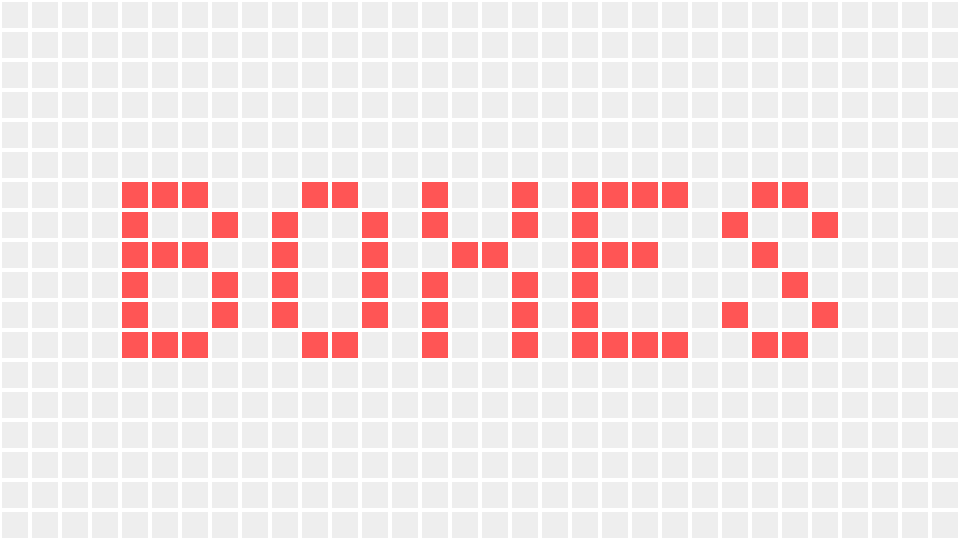
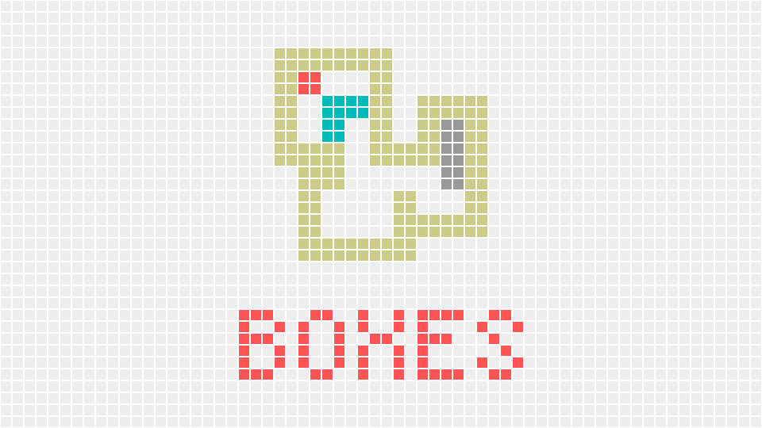

# AIBall Creator

AIBall Creator is a cutting-edge software that empowers users to create stunning videos with a captivating pixel art aesthetic. With its intuitive interface and powerful features, this software opens up a world of creative possibilities, allowing you to bring the nostalgic charm of pixel art to your videos.

## Getting started

```sh
# Optional step. If you have gifsicle installed, the size of the generated video will be significantly optimized.
$ apt install gifsicle

$ git clone https://github.com/mohanson/aiball-creator
# The resulting video is located at res/aisoko.gif
$ go run cmd/boxes/main.go
```



You can also use aiball to make static images

```sh
$ go run cmd/boxes-picture/main.go p0
```


